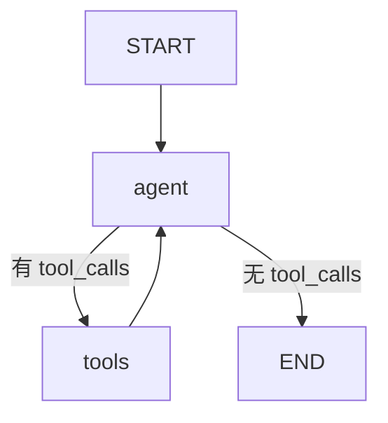

# ReAct 状态流转图

```mermaid
graph TD
    START --> agent
    agent -->|有 tool_calls| tools
    agent -->|无 tool_calls| END
    tools --> agent
```

# 三类 Agent 编排图

```mermaid
graph LR
    START --> planner
    planner --> retriever
    retriever --> summarizer
    summarizer --> END
```
